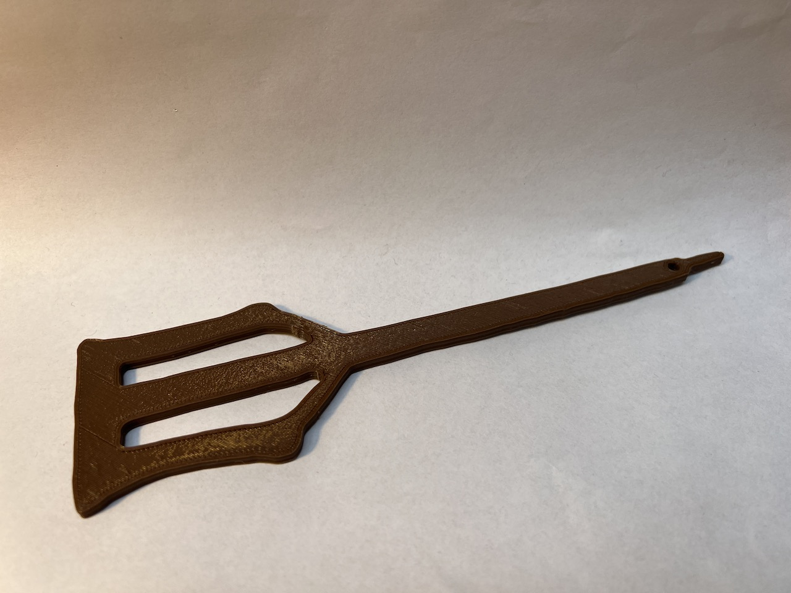

# Anglo-Saxon girdle-hanger

This is a 3D model of an Anglo-Saxon girdle-hanger from the 6th century that was found near Caistor, Lincolnshire, England. It is in The British Museum as museum number [1893,0618.19](https://www.britishmuseum.org/collection/object/H_1893-0618-19).

What was a girdle-hanger? We're not sure, but they probably [symbolise the idea that women controlled access to the home](http://teachinghistory100.org/objects/about_the_object/anglo_saxon_womans_key).

I took the photo, drew an outline of the left part using [Affinity Designer](https://affinity.serif.com/en-gb/designer/), extruded it and added a hanging hole in [Tinkercard](https://www.tinkercad.com/) and printed it on an [Anycubic Kobra](https://www.anycubic.com/products/kobra) 3D printer in [eSUN PLA+](https://www.esun3d.com/pla-pro-product/) Brown filament.

Files:

- [SVG outline](/girdle-hanger.svg)
- [STL for 3D printing](/girdle-hanger.stl)

Handy for school Anglo-Saxon projects!

# License

CC BY-NC-SA 4.0

# Author

Leon Brocard acme@astray.com